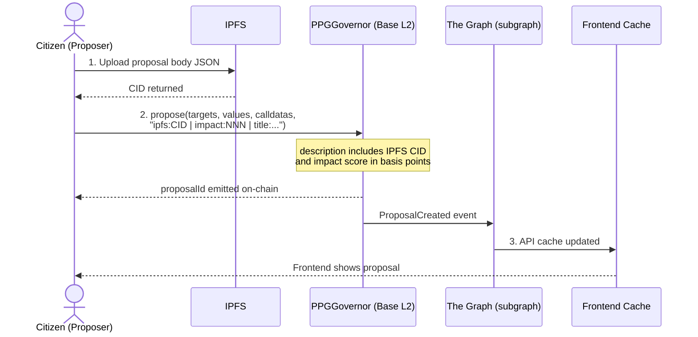
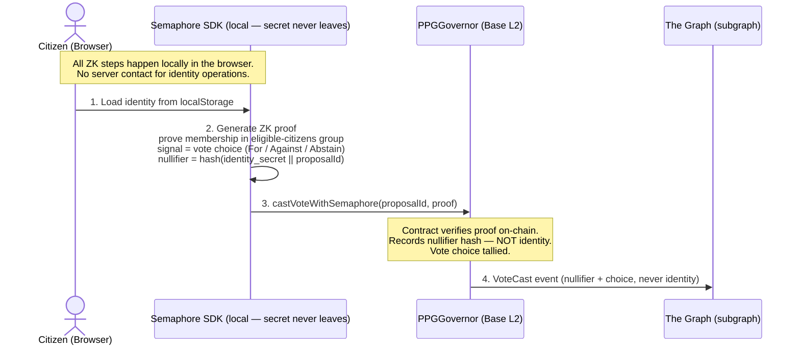
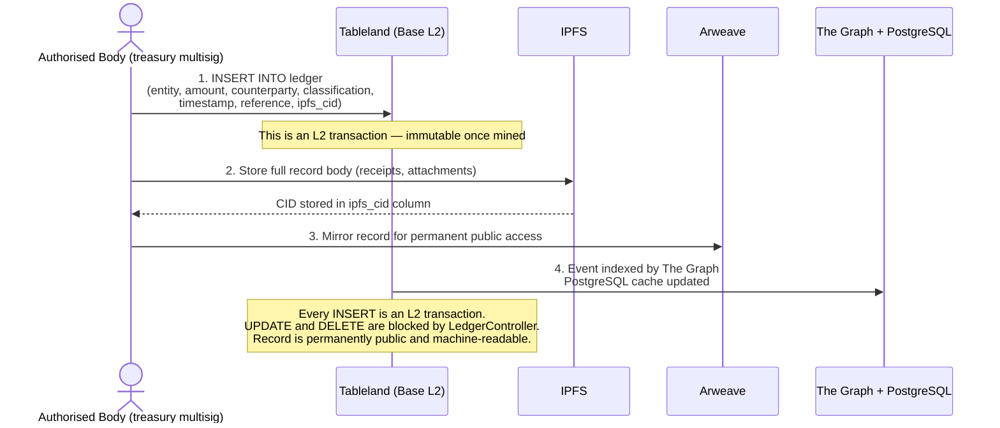

# PPG MVP — System Architecture

Source of truth hierarchy: **chain > content-addressed storage > local cache**.
The local PostgreSQL cache is always rebuildable from chain events + IPFS content.

---

## Component Diagram


---

## On-Chain / Off-Chain Partition

Following the Decentralisation Partition Principle from the paper (§11.5):

> Place on-chain only what must be **auditable by anyone, enforceable without trust, and
> permanently recorded**. Place off-chain everything that can be **verified by cryptographic
> reference** to an on-chain commitment.

| Item | Location | Justification |
|---|---|---|
| Nullifiers | On-chain (Semaphore) | Double-vote prevention is a chain invariant |
| Vote choices | On-chain (encoded in nullifier proof) | Tamper-proof, anonymous |
| Vote counts / quorum | On-chain (Governor) | Enforced atomically at state transition |
| Veto triggers | On-chain (Governor cancel) | Must be enforceable without operator |
| Financial ledger rows | Tableland (L2 txs) | Every write is a chain transaction |
| Ledger permanent archive | Arweave | Append-only, permanent, content-addressed |
| Proposal content hash | On-chain (Governor) | Binds description to proposal |
| Proposal body / attachments | IPFS + Filecoin | Verified via on-chain CID |
| Deliberation content | IPFS + Filecoin | Verified via on-chain CID |
| Query cache | PostgreSQL (local) | Performance only, rebuildable |

---

## Data Flow: Submitting a Proposal



## Data Flow: Casting a Vote (anonymous)



## Data Flow: Financial Ledger Record



---

## Rebuild Procedure (cache loss recovery)

If PostgreSQL is lost:

1. Replay all Governor contract events from block 0 → reconstruct proposal/vote state
2. Replay all Tableland ledger table writes → reconstruct Financial Ledger
3. Re-fetch IPFS CIDs listed in proposal and ledger records → restore content
4. Re-index via The Graph → restore GraphQL query layer

No data is ever permanently lost by losing the PostgreSQL instance.

---

## Anonymous Vote Submission — ERC-4337 Paymaster (Tier 2+)

A Semaphore anonymous vote carries a ZK proof, not a wallet signature. In Tier 2 the
citizen may have no EOA wallet at all. Someone must pay the gas for `castVoteAnonymous()`
to reach the chain. Two options — the spec recommends a sponsored relayer for Tier 2:

### Option A: Institution-sponsored relayer (recommended for Tier 2)

The institution runs a stateless relayer API. The citizen generates the ZK proof locally,
then POSTs only the proof (no identity material) to the relayer. The relayer signs and
broadcasts the transaction, paying gas from a prefunded address.

```
Citizen browser
  │
  ├─1─► Generate Semaphore proof locally (identity secret never transmitted)
  ├─2─► POST /vote { proposalId, support, merkleTreeRoot, nullifierHash, proof[8] }
  │       Relayer validates: proposal is Active, nullifierHash not used (read-only check)
  ├─3─► Relayer calls PPGGovernor.castVoteAnonymous(...) — signs with relayer key, pays gas
  └─4─► Transaction confirmed; relayer returns tx hash to browser
```

**Privacy note:** The relayer sees the proof and the IP address of the voter. Timing
correlation is possible if the relayer is malicious. Mitigations: TOR/VPN on the
citizen's side, batched submission with random delay, or using a publicly operated
relayer (e.g. PSE's infrastructure). The relayer cannot link the proof to the identity
— the identity secret is never transmitted.

**Relayer prefund:** The institution tops up the relayer address via a governance proposal
(Tableland INSERT + token transfer). The expected cost per vote is ~$0.0012 (Tier 2).
Budget $0.01 per eligible citizen per year for the relayer fund.

### Option B: ERC-4337 Paymaster (for Tier 3 or if wallet UX is required)

If citizens do have AA wallets (e.g. Safe{Core} or Biconomy), use an ERC-4337 Paymaster:

```
UserOperation:
  sender:    citizen AA wallet address   ← visible to bundler
  callData:  castVoteAnonymous(proof...) ← only ZK data, no identity
  paymasterAndData: <institution paymaster address + signed approval>

EntryPoint → Paymaster.validatePaymasterUserOp() → institution approves gas
EntryPoint → PPGGovernor.castVoteAnonymous(proof...)
```

**Provider:** Pimlico or Alchemy Account Kit. The institution deploys a `VerifyingPaymaster`
that allows any UserOperation targeting `PPGGovernor.castVoteAnonymous()` from a registered
AA wallet. Paymaster prefund: deposit ETH into EntryPoint via `paymaster.deposit()`.

**Privacy note:** The AA wallet address is visible in the UserOperation. For maximum
anonymity, Option A (relayer) provides stronger unlinkability.

### Deployment decision

| | Option A (relayer) | Option B (ERC-4337) |
|---|---|---|
| Gas payer | Relayer EOA | Institution Paymaster |
| Citizen needs wallet | No | Yes (AA wallet) |
| Citizen address visible | No | Yes (AA wallet address) |
| Privacy strength | Higher | Lower |
| Operational complexity | Low | Medium |
| Recommended tier | Tier 2 | Tier 3 (if AA wallet UX required) |

---

## The Graph — Subgraph Manifest Skeleton

The subgraph indexes all PPGGovernor, Semaphore group, and Tableland events. Below is
the minimum `subgraph.yaml` structure:

```yaml
specVersion: 1.0.0
schema:
  file: ./schema.graphql

dataSources:
  - kind: ethereum
    name: PPGGovernor
    network: base
    source:
      address: "<PPGGovernor address>"
      abi: PPGGovernor
      startBlock: <deployment block>
    mapping:
      kind: ethereum/events
      apiVersion: 0.0.7
      language: wasm/assemblyscript
      entities:
        - Proposal
        - VoteCast
        - VetoPetition
      abis:
        - name: PPGGovernor
          file: ./abis/PPGGovernor.json
      eventHandlers:
        - event: ProposalCreated(indexed uint256,indexed address,string,uint256,uint256,uint256)
          handler: handleProposalCreated
        - event: VoteCast(indexed address,indexed uint256,uint8,uint256,string)
          handler: handleVoteCast
        - event: VoteCastAnonymous(indexed uint256,uint8,uint256)
          handler: handleVoteCastAnonymous
        - event: ProposalExecuted(indexed uint256)
          handler: handleProposalExecuted
        - event: ProposalCanceled(indexed uint256)
          handler: handleProposalCanceled
        - event: ProposalImpactSet(indexed uint256,uint256,address)
          handler: handleProposalImpactSet
        - event: ConstitutionalValidationRecorded(indexed uint256,bytes32,bool)
          handler: handleConstitutionalValidationRecorded
        - event: VetoPetitionSigned(indexed uint256,uint256,uint256)
          handler: handleVetoPetitionSigned
        - event: ProposalVetoed(indexed uint256)
          handler: handleProposalVetoed
      file: ./src/ppg-governor.ts

  - kind: ethereum
    name: LedgerController
    network: base
    source:
      address: "<LedgerController address>"
      abi: LedgerController
      startBlock: <deployment block>
    mapping:
      kind: ethereum/events
      apiVersion: 0.0.7
      language: wasm/assemblyscript
      entities:
        - LedgerEntry
      abis:
        - name: LedgerController
          file: ./abis/LedgerController.json
      eventHandlers:
        - event: LedgerRowInserted(indexed uint256,address,uint256,string,string)
          handler: handleLedgerRowInserted
      file: ./src/ledger-controller.ts
```

Key implementation notes:
- `startBlock` must be set to the exact deployment block to avoid rescanning from genesis.
- `VoteCastAnonymous` handler must set `voter = null` and `nullifier = event.nullifierHash`
  on the `VoteCast` entity — never attempt to infer voter identity from other data.
- All handlers are idempotent — safe to re-run on chain reorgs.


## Technology Versions (Tier 1 MVP)

| Component | Package / Version |
|---|---|
| L2 chain | Base mainnet (OP Stack) |
| Governor | `@openzeppelin/contracts` v5 — `Governor`, `GovernorVotes`, `GovernorTimelockControl` |
| Anonymous voting | `@semaphore-protocol/contracts` v4, `@semaphore-protocol/identity` v4 |
| Tableland | `@tableland/sdk` v7, `@tableland/evm` |
| Indexing | The Graph hosted service or self-hosted Graph Node |
| IPFS client | `kubo` (go-ipfs) or `helia` (JS) |
| Arweave | `arweave-js` |
| Backend API | Node.js 22 LTS, Fastify v5, TypeScript 5 |
| Database cache | PostgreSQL 16 |
| ORM | Drizzle ORM (TypeScript-first, schema-as-code) |
| Frontend | Next.js 15 (App Router), wagmi v2, viem v2 |
| ZK proof generation | circom 2, snarkjs (client-side in browser) |
| Contract dev | Foundry (forge, cast, anvil) |
