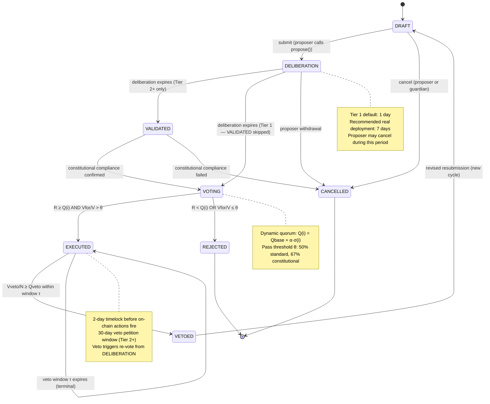
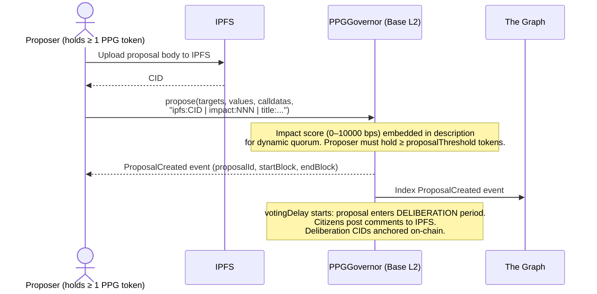
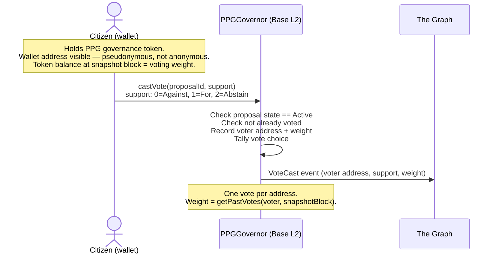
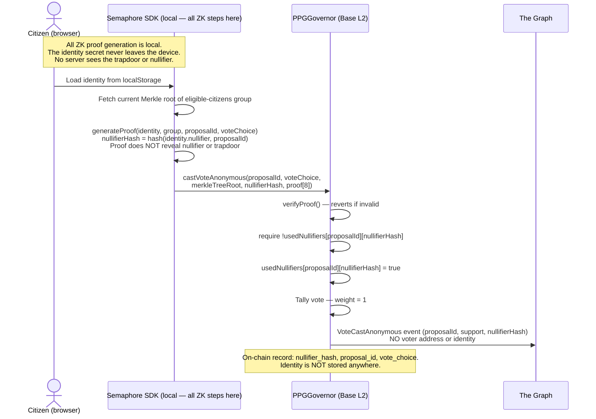

# PPG MVP — Governance Pipeline

Source: paper §5 (Formal Model), §4 (Framework Overview).

---

## Formal State Machine (from paper §5)

$$\mathcal{G} = (S,\ s_0,\ \Sigma,\ \delta,\ F)$$

| Symbol | Value |
|---|---|
| $S$ | `{DRAFT, DELIBERATION, VALIDATED, VOTING, EXECUTED, VETOED, CANCELLED}` |
| $s_0$ | `DRAFT` |
| $\Sigma$ | `{submit, open_deliberation, validate, open_voting, pass, fail, execute, veto, cancel}` |
| $F$ | `{EXECUTED, VETOED, CANCELLED}` |

### State Transitions



**Tier 1 simplification:** `VALIDATED` state is omitted (no constitutional validator in Tier 1).
Pipeline becomes: `DRAFT → DELIBERATION → VOTING → EXECUTED`.

### Quorum Function (paper eq. 3)

$$Q(i) = Q_{\text{base}} + \alpha \cdot \sigma(i)$$

Where:
- $Q_{\text{base}}$ = baseline participation threshold (default: 0.04 — 4% of eligible voters)
- $\alpha$ = sensitivity parameter (default: 0.10)
- $\sigma(i) \in [0,1]$ = normalised impact score of proposal $i$
- $Q(i) \in [0,1]$ = required participation rate for proposal $i$

### Pass Condition (paper eq. 4)

$$\text{pass}(d) \iff \frac{V_\text{for}}{V_\text{for} + V_\text{against}} \geq \theta \;\wedge\; \frac{V_\text{total}}{N} \geq Q(i)$$

Where:
- $\theta$ = approval threshold (default: 0.50 for standard proposals, 0.67 for constitutional)
- $N$ = total eligible voters at voting snapshot

### Veto Condition (paper eq. 6) — Tier 2+

$$\text{veto}(d) \iff \frac{P_\text{veto}}{N} \geq Q_\text{veto}$$

Where $Q_\text{veto}$ is the veto petition threshold (default: 0.10 — 10% of eligible voters).

---

## OpenZeppelin Governor Mapping

OpenZeppelin Governor v5 implements the core propose → vote → timelock → execute pipeline.
The mapping from the PPG formal model to OZ Governor settings:

| PPG concept | OZ Governor mechanism |
|---|---|
| `DRAFT` | Proposal created, not yet active |
| `DELIBERATION` | Voting delay period (`votingDelay`) |
| `VOTING` | Active voting window (`votingPeriod`) |
| `EXECUTED` | `execute()` called after timelock |
| `VETOED` | Tier 2: custom `veto()` function (not native OZ) |
| `CANCELLED` | `cancel()` — proposer or guardian |
| Quorum | `quorum(blockNumber)` — overridden to implement $Q(i)$ |
| Pass threshold | `_voteSucceeded()` — overridden to implement $\theta$ |
| Timelock | `GovernorTimelockControl` — mandatory execution delay after pass |

### OZ Governor Parameters (Tier 1 defaults)

```solidity
uint48  votingDelay  = 7 days;          // DELIBERATION window (use 1 day for testnet/pilot only — matches contracts.md constructor default)
uint32  votingPeriod = 7 days;          // VOTING window
uint256 proposalThreshold = 1e18;       // Minimum tokens to propose (1 PPG token)
uint256 quorumNumerator = 4;            // 4% baseline quorum (overridden by dynamic quorum)
uint256 timelockDelay = 2 days;         // Execution delay after pass
```

These are governance-adjustable parameters — the Governor itself can change them via
a passed proposal, with the same quorum and timelock requirements applied.

---

## Proposal Lifecycle: Detailed Flow

### 1. Proposal Submission (DRAFT → DELIBERATION)



**Deliberation content** (off-chain):
- Citizens post structured comments to IPFS, referencing the proposal CID
- Comment CIDs are aggregated off-chain and anchored on-chain before voting opens
- The deliberation record is permanently archived on Arweave

### 2. Deliberation Period

- Duration: `votingDelay` (default 1 day in Tier 1; suggest 7 days for real deployments)
- Off-chain deliberation on IPFS
- No on-chain action required during this period
- Proposer may cancel during deliberation

### 3. Voting (DELIBERATION → VOTING)

**Tier 1 (pseudonymous):**



**Tier 2+ (anonymous, Semaphore):**



### 4. Quorum and Pass Evaluation (automatic at voting period end)

The Governor evaluates the pass condition when `execute()` is called. Dynamic quorum is
implemented by overriding `_quorumReached(uint256 proposalId)` — the OZ hook that does
receive the proposal ID. The `quorum(uint256 timepoint)` function (which only receives a
block snapshot, not a proposalId) is also overridden to return the base quorum for display
purposes only; it is not the binding check.

```solidity
/// @dev Binding quorum check at execution time. Receives proposalId → can use impact score.
///      OZ Governor calls this inside _voteSucceeded().
function _quorumReached(uint256 proposalId) internal view override returns (bool) {
    (, uint256 forVotes, uint256 abstainVotes) = proposalVotes(proposalId);
    uint256 totalVotes = forVotes + abstainVotes; // OZ default: abstain counts toward quorum

    uint256 snapshot   = proposalSnapshot(proposalId);
    uint256 totalSupply = token.getPastTotalSupply(snapshot);

    uint256 impactBps = proposalImpact[proposalId]; // 0–10000; set by IMPACT_ASSESSOR_ROLE
    uint256 qBase     = quorumBaseNumerator();       // default: 400 (4%)
    uint256 alpha     = quorumAlpha();               // default: 1000 (10%)
    // Impact score can only raise quorum above the baseline — never below it.
    uint256 qDynamic  = qBase + (alpha * impactBps / 10000);

    return totalVotes >= (totalSupply * qDynamic / 10000);
}

/// @dev Returns base quorum for display (no proposalId available here).
///      The binding dynamic-quorum check happens in _quorumReached() above.
function quorum(uint256 timepoint) public view override returns (uint256) {
    return token.getPastTotalSupply(timepoint) * quorumBaseNumerator() / 10000;
}
```

**Impact score governance:** The impact score for a proposal is set by an address holding
`IMPACT_ASSESSOR_ROLE` (the governance council multisig), not by the proposer. The proposer
may include a suggested impact in the description string (`"impact:NNN"`), but this is
advisory only — the assessor calls `setProposalImpact(proposalId, bps)` before voting
opens. If the assessor does not act, `proposalImpact[proposalId]` defaults to `0`, which
keeps quorum at the baseline `qBase`. The assessor cannot lower quorum below the baseline.

### 5. Execution (VOTING → EXECUTED)

If pass condition met → timelock starts → after timelock delay → anyone can call `execute()`
→ on-chain actions encoded in proposal are executed atomically.

If the proposal includes a Financial Ledger write, the Tableland INSERT is part of the
execution calldata — the spend is recorded in the same transaction that executes the decision.

### 6. Veto (Tier 2+, EXECUTED → VETOED)

After execution, a veto petition window opens (default: 30 days). If 10% of eligible
voters sign the veto petition on-chain, a re-vote is triggered. The re-vote follows the
same pipeline from DELIBERATION. This is the self-correcting safety valve from paper §5.4.

---

## Legitimacy Score (paper §5.5, eqs. 5–6)

The full paper formula is:

$$L(d) = w_1 \cdot R(d) + w_2 \cdot \frac{V_{\text{for}}(d)}{V(d)} + w_3 \cdot \Delta_{\text{delib}}(d), \quad w_1 + w_2 + w_3 = 1$$

Where $R(d) = V(d)/N$ is the participation rate, $V_{\text{for}}(d)/V(d)$ is the approval
margin, and $\Delta_{\text{delib}}(d)$ is the structured deliberation quality score:

$$\Delta_{\text{delib}}(d) = a_1 \cdot A(d) + a_2 \cdot E(d) + a_3 \cdot D(d) + a_4 \cdot I(d), \quad a_1 + a_2 + a_3 + a_4 = 1$$

| Component | Symbol | Measurement |
|---|---|---|
| Argument diversity | $A(d)$ | Distinct argument positions as fraction of max theoretical positions |
| Expert coverage | $E(d)$ | Proportion of affected domains with at least one expert contribution |
| Deliberation depth | $D(d)$ | Mean reply-chain depth normalised to configured max depth |
| Inclusive participation | $I(d)$ | Fraction of eligible citizens who contributed at least one deliberation comment |

All four components are computable from the public deliberation archive on IPFS — no
subjective quality judgements required.

**Weight calibration:** The paper (§5.5) explicitly states that $w_1$--$w_3$ and
$a_1$--$a_4$ **cannot be set to useful defaults before deployment**. Their values require
regression against participant satisfaction data from real governance rounds. The first
empirical priority of every Tier 1 deployment is generating enough participant outcome data
to estimate all seven weights. Until then, treat any fixed defaults ($w_1=w_2=w_3=1/3$,
$a_i=1/4$) as placeholders that produce a structurally correct but uncalibrated score.

**Implementation:**
- $R(d)$, $V_{\text{for}}/V$: read directly from on-chain Governor state via The Graph.
- $A(d)$, $E(d)$, $D(d)$, $I(d)$: computed by the backend API from the IPFS deliberation
  archive after the voting period closes.
- $L(d)$ is stored in the `Proposal` entity in The Graph subgraph and in PostgreSQL cache.
- Not enforced on-chain in Tier 1 — used for the governance health dashboard and for
  cross-decision longitudinal comparison as described in the paper.

---

## The Graph Subgraph Events to Index

```graphql
type Proposal @entity {
  id: ID!
  proposalId: BigInt!
  proposer: Bytes!
  description: String!
  ipfsCid: String
  impactScore: BigDecimal
  state: String!
  votesFor: BigInt!
  votesAgainst: BigInt!
  votesAbstain: BigInt!
  totalEligible: BigInt!
  quorumRequired: BigInt!
  legitimacyScore: BigDecimal
  createdAt: BigInt!
  executedAt: BigInt
  cancelledAt: BigInt
}

type VoteCast @entity {
  id: ID!
  proposalId: BigInt!
  voter: Bytes         # null if Semaphore (anonymous)
  nullifier: Bytes     # set if Semaphore vote
  support: Int!
  weight: BigInt!
  blockTimestamp: BigInt!
}
```

Note: `voter` is null and `nullifier` is set for anonymous Semaphore votes. The subgraph
never stores the link between a nullifier and an address — that link does not exist.
