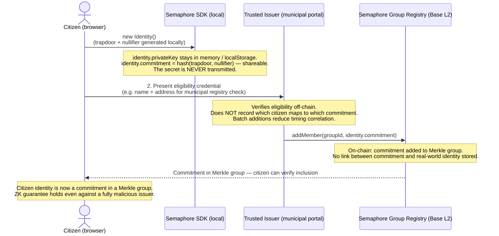
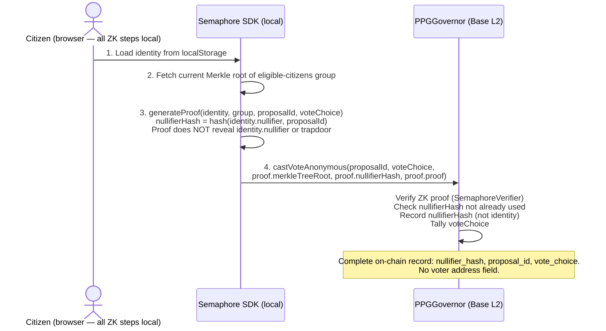
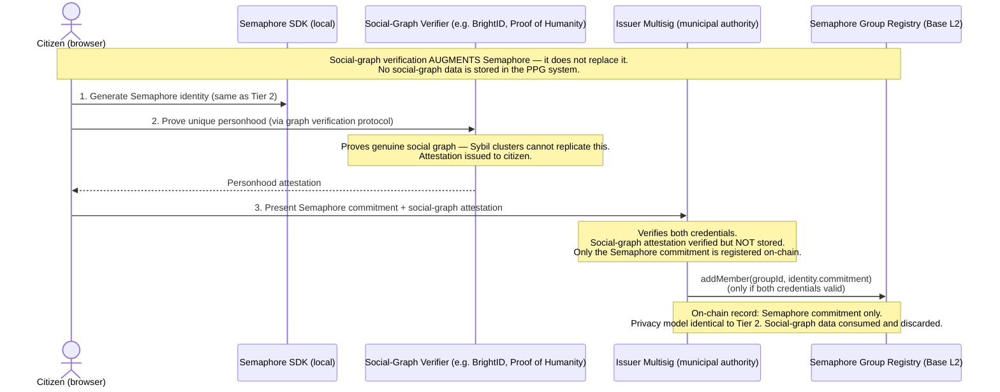

# PPG MVP — Identity Model

Source: paper §6 (Identity Model), §4.2 (Transparency Default).

---

## Core Privacy Guarantee

**The system cannot link a vote choice to a citizen identity — not even an administrator
with full database and chain access.** This is a protocol property enforced by cryptography,
not an access-control policy.

**Private keys never leave the citizen's device.** Government ID verification produces
an on-chain commitment only. No server ever handles the citizen's secret.

---

## What Is and Is Not Recorded

| Item | Recorded? | Where |
|---|---|---|
| That an eligible citizen cast a vote on proposal X | Yes | Nullifier on-chain |
| Which citizen cast that vote | **Never** | Not recorded anywhere |
| The vote choice linked to a citizen | **Never** | Not recorded anywhere |
| The aggregate vote tally | Yes | Governor contract |
| Citizen's eligibility commitment | Yes | Semaphore group (on-chain) |
| Citizen's identity secret | **Never** | Stays on device |
| Government ID number | **Never** | Not transmitted, not stored |

---

## Identity Progression by Tier

### Tier 1 — Wallet Authentication (pseudonymous)

Citizens authenticate with an Ethereum wallet. One wallet address = one voting credential.
The wallet address is pseudonymous — not linked to real-world identity by the system.

**Sybil resistance in Tier 1:** The participating body maintains an off-chain allowlist of
eligible wallet addresses (e.g. verified by municipal membership roll). Only allowlisted
addresses can vote. This is a trusted-coordinator model, acceptable for small-scale pilots.

**What Tier 1 does NOT provide:**
- Anonymity (wallet address is visible)
- Sybil resistance against the body maintaining the allowlist
- Cryptographic unlinkability

### Tier 2 — Semaphore Anonymous Voting

Citizens generate a Semaphore identity locally. A trusted issuer verifies eligibility
and adds the citizen's commitment to the on-chain group. Votes are submitted with ZK proofs
that prove group membership without revealing which member is voting.

### Tier 3 — Self-Sovereign ZK Eligibility

Citizens self-prove eligibility from a government-issued credential using a ZK circuit,
with no trusted issuer for the issuance step. The credential is verified by the circuit;
the issuer (government) provides the credential but does not participate in the on-chain
registration.

---

## Tier 2 Identity: Semaphore v4

### What Semaphore Provides

Semaphore (PSE / Ethereum Foundation) is a ZK group membership protocol:

- A citizen generates an **identity** client-side: `(trapdoor, nullifier) → commitment = hash(nullifier, trapdoor)`
- The commitment is added to an on-chain Merkle group by a trusted issuer
- To signal (vote), the citizen generates a ZK proof:
  - Proves they know `(trapdoor, nullifier)` such that `commitment` is in the group
  - Binds the signal (vote choice) to an **external nullifier** (= `proposalId`)
  - Produces a **nullifier hash** = `hash(nullifier || proposalId)` — unique per identity per proposal
- The contract verifies the proof, records the nullifier hash (prevents double-voting), tallies the vote
- The identity commitment is never linked to the nullifier hash — this is the ZK guarantee

### Identity Setup Flow (Tier 2)



### Vote Flow (Tier 2)



### What the Chain Stores per Vote

```
nullifier_hash: 0xabcd...  (unique per identity per proposal — reveals nothing about identity)
proposal_id:    0x1234...
vote_choice:    1           (For)
```

That is the complete on-chain vote record. There is no field for voter address or identity.

---

## Semaphore Group Management

One Semaphore group per eligible population (e.g. "residents of municipality X, 2025 roll").

```
Group 1: eligible-voters-municipality-x-2025
  Members: [commitment_1, commitment_2, ..., commitment_n]
  Admin:   multisig of municipal election authority
  Chain:   Base mainnet
```

New groups are created for each governance cycle. A citizen's identity commitment can be
added to multiple groups (e.g. if eligible in multiple jurisdictions). The same identity
commitment generates different nullifier hashes for different proposals — no cross-proposal
tracking is possible.

---

## Issuer Behaviour Requirements

The trusted issuer (the body that calls `addMember`) must follow these requirements
to preserve the privacy guarantee:

1. **Do not record the mapping** between the citizen's real identity and their commitment.
   Verify eligibility, add the commitment, discard the association.
2. **Batch additions** where possible to reduce timing correlation attacks.
3. **Publish the full group membership** (list of commitments) so citizens can verify
   their commitment is present without trusting the issuer.
4. **Use a multisig** for group administration — no single admin key.

If the issuer violates rule 1, they can link commitments to identities — but they still
cannot link vote choices to identities, because the nullifier hash used in voting is
derived from the identity's nullifier (secret), not the commitment (public). The ZK
guarantee holds even against a fully malicious issuer.

---

## Tier 3: Self-Sovereign ZK (no trusted issuer for issuance)

In Tier 3, the citizen self-proves eligibility from a government-issued credential
(e.g. national ID, eIDAS credential, passport). The circuit proves:
- "I hold a credential issued by authority X"
- "This credential attests I am a resident of jurisdiction Y"
- "This credential is not expired"
- Without revealing: the credential itself, the citizen's name, ID number, or any
  other identifying information

This uses **nullifier-based ZK credentials** derived from the W3C Verifiable Credentials
standard with ZK extensions (e.g. Anon Aadhaar approach, or zkEmail for email-based credentials).

The government is the credential issuer but does not participate in governance registration.
The citizen controls when and how to use the credential.

---

## Device Loss / Key Recovery

In Tier 1: Standard wallet recovery (seed phrase).

In Tier 2 (Semaphore): The identity commitment is already on-chain in the Merkle group.
If the citizen loses their device:
1. They generate a new Semaphore identity on a new device
2. They re-verify eligibility with the issuer
3. The issuer adds the new commitment to the group
4. Old commitment becomes unused (no security impact — it cannot vote because the secret
   is lost; the nullifier hashes from the old identity are not reusable)

There is no key escrow. There is no recovery that involves the server seeing the secret.
The trade-off (loss of old voting history on new device) is the correct one given the
privacy requirement.

---

## Member Revocation (Tier 2+)

A citizen may lose eligibility after enrollment — for example, by moving jurisdiction,
being found to hold a duplicate registration, or by court order. The issuer multisig can
remove a commitment from the Semaphore group:

```
Issuer multisig calls:
  SemaphoreGroup.removeMember(
    groupId,
    identityCommitment,       // the commitment to remove
    merkleProofSiblings[]     // Merkle proof of current membership (required by Semaphore)
  )
```

**Properties after revocation:**

| Property | Outcome |
|---|---|
| Past votes by this commitment | Valid and permanent — nullifiers remain in `usedNullifiers`, vote tallies unchanged |
| Future votes by this commitment | Impossible — commitment is no longer a leaf in the Merkle tree; ZK proof will fail verification |
| Double-vote prevention | Unchanged — past nullifier hashes still block reuse |
| Privacy of past votes | Unchanged — nullifier hashes on-chain reveal nothing about identity |

**Issuer tracking requirement:** To call `removeMember()`, the issuer must supply the
current Merkle siblings. This requires that the issuer tracks which commitment belongs
to which eligible-citizen record (internally, off-chain). This is an operational requirement
and a **deliberate privacy trade-off**: the issuer can link a commitment to a citizen for
revocation purposes. The ZK privacy guarantee still holds — the issuer cannot link the
commitment to any vote choice, because the nullifier hash used in voting is derived from
the secret trapdoor (which the issuer never saw).

**Operational policy:** Revocation requests must be approved by the issuer multisig (3-of-5),
not by any single operator, to prevent unilateral disenfranchisement.


---

## Social-Graph Sybil Resistance (Tier 3 complement — paper §6.3)

The paper specifies a **hybrid** Sybil resistance model. Semaphore ZK group membership
(Tier 2) prevents double-voting by an enrolled identity, but does not prevent a single
person controlling multiple enrolled identities if the issuer is compromised or colluding.
At national scale, a purely issuer-trust model is insufficient.

The paper's third component is social-graph verification (Pentland 2014): the structure
of mutual-attestation networks statistically identifies likely fake accounts even without
revealing identity, because genuine social graphs have characteristic topological properties
(clustering, short path lengths, sparse cut-width to fake clusters) that manufactured
Sybil networks do not replicate.

### Candidate implementations for Tier 3

| Approach | How it works | Readiness |
|---|---|---|
| **Proof of Humanity** (v2 / UBI DAO) | Video + vouching graph; registered humans earn SBT credential | Production (Ethereum mainnet) |
| **Worldcoin / World ID** | Iris biometric → ZK proof of unique personhood | Production; privacy controversy — evaluate carefully |
| **BrightID** | Social graph of mutual attestations; no biometrics | Production; open source |
| **Trustful** (PSE research) | ZK social graph verification — proves graph properties without revealing graph | Research prototype |

### Integration pattern (Tier 3)

Social-graph verification **augments** Semaphore — it does not replace it.



No social-graph data is stored in the PPG system. The graph verifier is an external oracle
whose attestation is consumed at enrollment and discarded. The on-chain record is only the
Semaphore commitment — the same privacy model as Tier 2.

**Decision gate:** After Tier 2 production and before Tier 3, evaluate BrightID vs
Proof of Humanity vs World ID against the four paper criteria (uniqueness, privacy,
scalability, Sybil resistance) in the deployment jurisdiction. The paper explicitly treats
this as subject to revision as the identity ecosystem matures.
