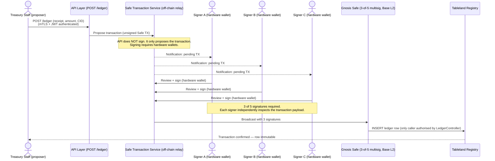
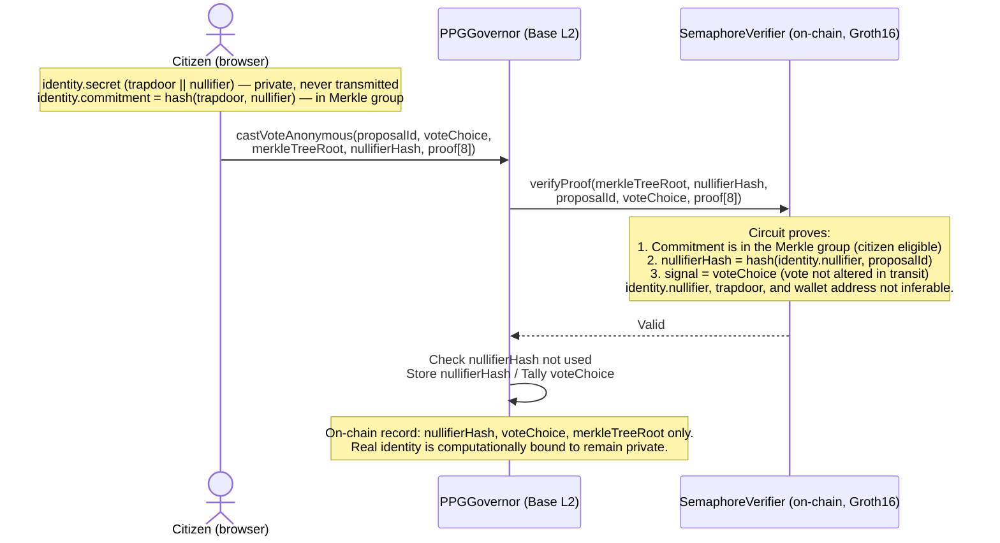
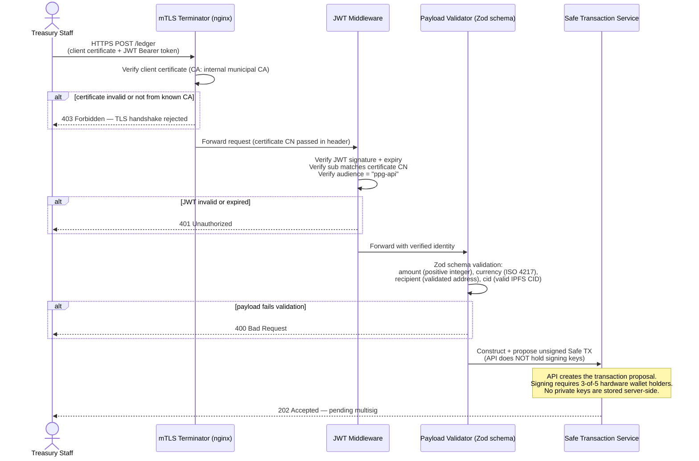

# PPG MVP — Security Specification

This document covers how write access is cryptographically enforced for every data
mutation in the system. The principle: **no trust in any operator, server, or process
— all write authorization is enforced on-chain by smart contracts**.

---

## Threat Model

| Threat | Attack vector | Mitigation |
|---|---|---|
| Fraudulent ledger entry | Unauthorized actor submits INSERT to Tableland | `LedgerController` contract rejects any non-multisig caller |
| Ledger tampering | Actor modifies or deletes a record | `LedgerController` disallows UPDATE and DELETE — enforced at Tableland validator level |
| Double voting | Citizen casts two votes on same proposal | Semaphore nullifier uniqueness enforced on-chain — contract reverts on duplicate |
| Vote identity linkage | Derive which citizen cast which vote | Cryptographically impossible by ZK proof construction — no server sees the trapdoor |
| Sybil voting | One person controls multiple voting identities | Semaphore group membership controlled by issuer multisig; one commitment per verified citizen |
| Proposal spam | Flood contract with junk proposals | `proposalThreshold` — must hold governance tokens to propose |
| Governance takeover | Accumulate tokens, pass malicious proposal | Timelock delay (2 days) + quorum requirement + veto petition window |
| Key compromise (multisig) | One signer key stolen | 3-of-5 multisig — single key cannot authorize anything |
| Admin backdoor | Deployer retains upgrade rights | No proxy contracts; TimelockController admin is `address(0)` post-deploy |
| Replay attack | Reuse a valid signed transaction on a different chain | All transactions include `chainId` (EIP-155); Semaphore scope binds proof to specific `proposalId` |
| IPFS content substitution | Replace proposal body at same CID | Impossible — IPFS CIDs are content hashes; changing content changes the CID |

---

## 1. Tableland Write Authorization

Tableland enforces write access through an on-chain **controller contract** assigned
to each table. Every mutation (INSERT, UPDATE, DELETE) submitted to Tableland triggers
an on-chain call to `controller.getPolicy(caller, tableId)` before the validator
accepts the transaction. If the policy denies the operation, the transaction reverts.

### How it works

```mermaid
sequenceDiagram
    actor Actor
    participant Tableland as Tableland Registry (Base L2)
    participant Controller as LedgerController (on-chain)
    participant Table as Ledger Table (immutable)

    Actor->>Tableland: Submit INSERT transaction
    Tableland->>Controller: getPolicy(msg.sender, tableId)
    Note over Controller: Returns Policy: allowInsert, allowUpdate,<br/>allowDelete, withCheck, whereClause
    alt caller has LEDGER_WRITER_ROLE
        Controller-->>Tableland: allowInsert=true, allowUpdate=false, allowDelete=false
        Tableland->>Table: Write row — immutable once mined, Merkle root updated
        Tableland-->>Actor: Transaction confirmed
    else caller does NOT have LEDGER_WRITER_ROLE
        Controller-->>Tableland: allowInsert=false
        Tableland-->>Actor: Transaction reverts
    end
    Note over Table: UPDATE and DELETE are blocked at the<br/>Tableland contract level — not application code.
```

### `LedgerController` Contract

```solidity
// SPDX-License-Identifier: MIT
pragma solidity ^0.8.24;

import "@tableland/evm/contracts/ITablelandController.sol";
import "@tableland/evm/contracts/utils/TablelandPolicy.sol";
import "@openzeppelin/contracts/access/AccessControl.sol";

contract LedgerController is ITablelandController, AccessControl {

    bytes32 public constant LEDGER_WRITER_ROLE = keccak256("LEDGER_WRITER_ROLE");

    // tableId → whether this controller manages it
    mapping(uint256 => bool) public managedTables;

    constructor(address multisig) {
        // Multisig is the only writer in Tier 1
        _grantRole(DEFAULT_ADMIN_ROLE, multisig);
        _grantRole(LEDGER_WRITER_ROLE, multisig);
    }

    /// @notice Called by Tableland validator before every mutation.
    ///         Returns a Policy that allows INSERT only from LEDGER_WRITER_ROLE.
    function getPolicy(address caller, uint256 /*tableId*/)
        external
        view
        override
        returns (TablelandPolicy memory)
    {
        bool isAuthorizedWriter = hasRole(LEDGER_WRITER_ROLE, caller);

        return TablelandPolicy({
            allowInsert: isAuthorizedWriter,
            allowUpdate: false,      // never — records are immutable
            allowDelete: false,      // never — records are permanent
            whereClause: "",         // no row-level filter needed (insert only)
            withCheck: "",           // field validation handled in API layer before submission
            updatableColumns: new string[](0)
        });
    }

    /// @notice Add a new authorized writer (e.g. Governor Timelock in Tier 2).
    ///         Requires multisig to call — governed by AccessControl.
    function addWriter(address writer) external onlyRole(DEFAULT_ADMIN_ROLE) {
        _grantRole(LEDGER_WRITER_ROLE, writer);
    }

    function removeWriter(address writer) external onlyRole(DEFAULT_ADMIN_ROLE) {
        _revokeRole(LEDGER_WRITER_ROLE, writer);
    }
}
```

### Authorized Writers by Tier

| Tier | Authorized writer(s) |
|---|---|
| Tier 1 | Gnosis Safe multisig (3-of-5 treasury signers) |
| Tier 2 | Gnosis Safe multisig + PPGTimelockController (for governance-approved spends) |
| Tier 3 | PPGTimelockController only — no human multisig write path |

### Gnosis Safe Signing Flow (Tier 1 ledger insert)



**The critical property:** the INSERT only reaches Tableland if 3 hardware-wallet
signatures over the exact calldata are collected. A compromised server cannot forge
signatures. A compromised single signer cannot authorize the transaction.

---

## 2. Vote Security

### Tier 1 — Pseudonymous (EIP-712 signed transactions)

Standard EVM transaction signing. Each vote is an `eth_sendTransaction` call signed
by the citizen's private key (in their wallet — never transmitted to any server).
The Governor contract records the voter address and weight. The wallet is the identity.

### Tier 2 — Anonymous (Semaphore ZK proof)

The vote is not signed with a wallet key. It carries a ZK proof instead.

#### What the ZK proof guarantees on-chain



#### On-chain verification flow

```solidity
function castVoteAnonymous(
    uint256 proposalId,
    uint8 support,
    uint256 merkleTreeRoot,
    uint256 nullifierHash,
    uint256[8] calldata proof
) external {
    // 1. Proposal must be in Active state
    require(state(proposalId) == ProposalState.Active, "Not active");

    // 2. Merkle root must be a valid historical root of the eligible-citizens group
    //    (Semaphore supports recent historical roots to tolerate latency)
    semaphore.verifyProof(
        semaphoreGroupId,
        SemaphoreProof({
            merkleTreeDepth: TREE_DEPTH,
            merkleTreeRoot: merkleTreeRoot,
            nullifier: nullifierHash,
            message: uint256(support),
            scope: proposalId,
            points: proof
        })
    ); // reverts if proof invalid

    // 3. Nullifier must not have been used before (double-vote prevention)
    require(!usedNullifiers[proposalId][nullifierHash], "Already voted");
    usedNullifiers[proposalId][nullifierHash] = true;

    // 4. Tally the vote.
    // MUST NOT call the base _countVote(proposalId, address(0), ...) directly.
    // OZ GovernorCountingSimple tracks hasVoted[account]: the first anonymous vote would
    // set hasVoted[address(0)] = true and all subsequent anonymous votes would revert with
    // GovernorAlreadyCastVote(address(0)). Double-vote prevention is handled by the
    // nullifierHash check above, not by OZ's hasVoted mechanism.
    //
    // PPGGovernor MUST override _countVote to skip the hasVoted check for address(0):
    //
    // function _countVote(uint256 proposalId, address account, uint8 support,
    //                      uint256 weight, bytes memory params) internal override {
    //     if (account == address(0)) {
    //         // Anonymous vote: increment tallies directly, do not record as hasVoted
    //         ProposalVote storage pv = _proposalVotes[proposalId];
    //         if (support == 0) pv.againstVotes += weight;
    //         else if (support == 1) pv.forVotes += weight;
    //         else pv.abstainVotes += weight;
    //     } else {
    //         super._countVote(proposalId, account, support, weight, params);
    //     }
    // }
    _countVote(proposalId, address(0), support, 1, "");

    emit VoteCastAnonymous(proposalId, support, nullifierHash);
}
```

**What the contract stores:** `usedNullifiers[proposalId][nullifierHash] = true` and
the aggregate tally. No address, no identity reference.

#### Why the nullifier cannot be reversed to find the voter

`nullifierHash = hash(identity.nullifier || proposalId)`

`identity.nullifier` is generated locally by the Semaphore SDK and never transmitted.
It is not derivable from the `commitment` (which is public). The hash is one-way.
Even the group admin (the issuer who added the commitment) cannot reverse it — they
never saw `identity.nullifier`, only `commitment = hash(nullifier, trapdoor)`.

---

## 3. Proposal Submission Security

```solidity
function propose(...) external returns (uint256 proposalId) {
    // Caller must hold >= proposalThreshold tokens at current block
    require(
        token.getVotes(msg.sender) >= proposalThreshold,
        "Insufficient voting power"
    );
    // ...
}
```

The token threshold prevents spam. In Tier 1, tokens are distributed only to verified
participants by the issuer multisig, so the set of possible proposers is bounded and
known. In Tier 2, the Civic Participation Mandate record on-chain determines eligibility.

The `description` field is free text — the API layer validates the IPFS CID format
before any transaction is constructed, but the contract does not validate it (cannot
make off-chain IPFS calls). Validation responsibility:

| Layer | What it validates |
|---|---|
| API layer | CID format, field presence, impact score range (0–10000) |
| Contract | Proposer has sufficient tokens; proposal not already active |
| IPFS | Content integrity (CID is a content hash — substitution impossible) |
| The Graph | Indexes only proposals where CID resolves to valid JSON schema |

---

## 4. API Layer Security

The API layer is **not in the trust boundary** for any write operation. It is a
convenience layer for constructing and routing transactions; it cannot forge
on-chain state.

### What the API can and cannot do

| Action | Can API do it unilaterally? |
|---|---|
| Read chain/subgraph data | Yes (public) |
| Construct a Tableland INSERT | Yes — but it cannot submit without multisig signatures |
| Submit a vote | No — voter's wallet signs the transaction |
| Generate a Semaphore proof | No — citizen's browser does this with the local secret |
| Alter a submitted ledger record | No — Tableland policy rejects UPDATE/DELETE |
| Alter a submitted vote | No — chain state is immutable |

### API authentication (for the write endpoint)

The `POST /ledger` endpoint is not publicly accessible. It is an internal endpoint
used by treasury staff to initiate the multi-step ledger write flow.



The API never holds signing keys. It submits an *unsigned proposal* to the Safe.
Signers review and sign independently using their own hardware wallets.

### CORS and public endpoints

All `GET /ledger*` endpoints are fully public (no auth, no CORS restriction). The
ledger is a public record by design. Rate limiting applies to prevent scraping abuse:
100 req/min per IP, 1000 req/min per API key for bulk export.

---

## 5. Content Integrity (IPFS)

Proposal bodies and ledger record attachments are stored on IPFS. The CID (Content
Identifier) is a cryptographic hash of the content. It is stored on-chain in the
proposal description or ledger row.

**Substitution attack is impossible:** to replace content while keeping the same CID
requires finding a SHA-256 collision. The on-chain CID is the proof of integrity.
Any client can verify a document by computing its CID and comparing against the chain.

```
Verification procedure:
  1. Fetch ledger row from Tableland (or cache): { ..., ipfs_cid: "bafyXXX" }
  2. Fetch content from IPFS: ipfs get bafyXXX
  3. Compute CID of fetched content: ipfs add --only-hash fetched_file
  4. Assert computed CID == stored CID
  → If match: content is exactly what was recorded. If mismatch: content was corrupted.
```

---

## 6. Key Management Requirements

| Key | Holder | Type | Requirement |
|---|---|---|---|
| Multisig signer keys (×5) | Individual treasury officers | Hardware wallet (Ledger/Trezor) | Never on internet-connected device |
| Gnosis Safe address | Contract (no private key) | Smart contract wallet | Controlled by 3-of-5 signers |
| `LEDGER_WRITER_ROLE` admin | Gnosis Safe | Contract-enforced | Changes require multisig |
| Citizen identity secret (Tier 2) | Citizen device | Generated by Semaphore SDK | Never transmitted, never stored by server |
| Citizen wallet key (Tier 1) | Citizen device | Standard Ethereum key | Standard wallet security |
| API server key (JWT signing) | Internal IdP | Rotated every 24h | Not a signing key for any chain tx |
| Governor deployment key | Deployer | Hot wallet (deploy only) | Rotate after deployment; holds no ongoing privileges |

---

## 7. Deployment Security Checklist

Before any mainnet deployment:

- [ ] `PPGTimelockController` deployed with `admin = address(0)` — verify on-chain
- [ ] `PPGGovernor` is only proposer on timelock — verify role assignment
- [ ] `LedgerController` deployed with multisig as DEFAULT_ADMIN_ROLE — verify
- [ ] Tableland table controller set to `LedgerController` address — verify via Tableland Registry
- [ ] Tableland table policy: `allowInsert=true` (multisig only), `allowUpdate=false`, `allowDelete=false` — verify by calling `getPolicy`
- [ ] Gnosis Safe deployed with correct signers and threshold (3-of-5) — verify on-chain
- [ ] `LEDGER_WRITER_ROLE` granted only to Gnosis Safe — verify via `hasRole`
- [ ] No proxy contracts — verify no `ERC1967Proxy` or similar in deployment
- [ ] Foundry invariant tests pass: nullifier uniqueness, quorum enforcement, timelock bypass impossible
- [ ] Independent smart contract audit completed before accepting real transactions
- [ ] Semaphore group created with correct `groupId` stored in PPGGovernor
- [ ] Semaphore verifier address on Base mainnet confirmed against PSE official deployment
